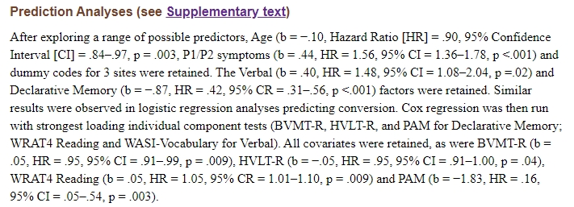

```{r setup, include=FALSE}
knitr::opts_chunk$set(echo = TRUE)
def.chunk.hook  <- knitr::knit_hooks$get("chunk")
knitr::knit_hooks$set(chunk = function(x, options) {
  x <- def.chunk.hook(x, options)
  ifelse(options$size != "normalsize", paste0("\n \\", options$size,"\n\n", x, "\n\n \\normalsize"), x)
})


library(tidyverse)
library(mlr)

```

# Structure of the tutorial
- June 28: Introduction to R & Data Wrangling
- June 29 (today): Practical Aspects of Data Wrangling, Hands-On ML Analyses
- June 30: Hands-On ML Analyses
- July 1: Hands-On ML Analyses

# Data Wrangling

Data wrangling and preprocessing is the most critical step in any data science project. We've seen examples of data cleaning yesterday. Today, we are going to connect data wrangling with Machine Learning (ML).
\
\
\
{ width=40% height=40% }


# Machine Learning

{ width=60% height=60% }
\
\
In this tutorial, we focus on supervised ML: learning how to best map an input (features) to an output (outcome) based on example input-output pairs ('labeled data').

# Quiz

{ width=33% height=33% }

# Data Wrangling
Some of the most common issues in data cleaning before ML include:

- Data-type constraints: values in a particular column must be of a particular type (e.g. "assessment date" should always be of type `date`)
- Range constraints: numbers should fall within a certain range (e.g. age cannot have a negative value)
- Mandatory constraints: certain columns cannot be empty (e.g. the outcome)
- Set-membership constraints: values in a column can only have certain values (e.g. gender/sex)
- Uniformity: values in a column should use the same units of measure (e.g. PANSS for symptoms)
- Algorithmic constraints: some ML algorithms only work with certain types of features; some types of features (e.g. dates) may not be usable 'as is' for ML

# Quiz
Whenever these (or other) criteria are not met, we need to 'wrangle' the data before transitioning to ML. But be careful which transformations you include...
\
\
{ width=33% height=33% }

# Data Wrangling
Data transformations that 'borrow' information from the whole data set (such as scaling) will lead to 'data leakage', and result in incorrect estimates of model performance when making predictions on new data. Hence, such transformations must be separated between training and testing (details later today).

Similarly, we can only use features available at the time of the prediction:
\
\
{ width=80% height=80% }

# Example
A model for predicting transition to psychosis in CHR (Cornblatt et al., 2015). What do you notice here? 
\
\
{ width=90% height=90% }

# Transformations to avoid: It's all in the title
{ width=100% height=100% }
\
\
Source: Gary Collins, https://bit.ly/2OKs3Sy

# Transformations to avoid: Dichotomization
Dichotomization of a continuous feature (e.g. by a median split):

- Inevitable loss of information and power → dichotomization is equivalent to losing 33% of the data (Royston et al., 2006)
- Choice of 'cut points': arbitrary (cannot be compared between studies), biologically implausible, risk of overfitting (more on that later today)
- If there are reasonable 'cut points' in the data, a (powerful) ML algorithm will find them
\
\
\
{ width=65% height=65% }

# Quiz

{ width=33% height=33% }

# Data wrangling for ML
Some types of features are hard to deal with for most standard ML algorithms. Data wrangling can help to make these variables usable: 

- Date: split into `year`, `month`, `day` 
- Zip codes: extract first 2-3 digits from each zip code
\
\
{ width=60% height=60% }

# Data wrangling for ML
Some algorithms only allow certain types of features: 

- SVM: only takes numeric features → dummy-code nominal features such as ethnic background
- SVM: does not allow missing values → remove cases with missing values or impute them (depending on the imputation method, this step needs to adhere to the principle of separating training and test data).
- Random Forests: allow any kind of feature and can also handle missing values → no specific treatment of the data required


# Feature selection in ML
- Bad, but common practices (Steyerberg et al., 2018):
  + Univariable screening of candidate predictors (→ data leakage)
  + High ratio: predictors/sample size (→ unstable estimates of predictive performance)
- Better: prespecification of features based on external knowledge
\

{ width=55% height=55% }


# Feature selection in ML

{ width=100% height=100% }

# Feature selection in ML

{ width=100% height=100% }
\
\
Padmanabhan et al., 2016


# The phases of prognostic/diagnostic model research
1. Development 
2. External validation(s) & updating
3. Software development & regulations
4. Impact assessment
5. Clinical implementation and scalability

- Most research focusses on development (also this tutorial)
- Few models are validated
- Fewer models reach implementation

# Prediction model? My prediction is that somebody already did it...
{ width=100% height=100% }
\
\
Source: @MaartenvSmeden on Twitter

# External model validation
Does my model work in data other than my own - collected by a different team of investigators, with different methods, at a different point in time...?
\
\
\
{ width=66% height=66% }


# Reproducibility: the challenge of precise reporting
Can others apply my model in their data set given the information I've provided?

- Rosen et al., 2021: 8 eligible studies could not be validated because of insufficient reporting
\

{ width=80% height=80% }
\

# Reproducibility: the challenge of precise reporting
Include information on:

- Handling of missing data
- Assessment & transformation of predictor variables
- Full model (coefficients, baseline hazard...)
- Optimal: open data & analysis code; online tool for application


{ width=80% height=80% }

Source: https://riskcalc.org/napls/

# Any questions?

{ width=33% height=33% }
\
\
Now, Julian and Pedro take over and walk you through a Machine Learning analysis using neuroimaging data.


# References
- Cornblatt, Barbara A., et al. "Psychosis prevention: a modified clinical high risk perspective from the recognition and prevention (RAP) program." American Journal of Psychiatry 172.10 (2015): 986-994.
- Rosen, Marlene, Betz, Linda T., et al. "Towards clinical application of prediction models for transition to psychosis: A systematic review and external validation study in the PRONIA sample." Neuroscience & Biobehavioral Reviews (2021).
- Royston, Patrick, Douglas G. Altman, and Willi Sauerbrei. "Dichotomizing continuous predictors in multiple regression: a bad idea." Statistics in Medicine 25.1 (2006): 127-141.
- Steyerberg, Ewout W., et al. "Poor performance of clinical prediction models: the harm of commonly applied methods." Journal of Clinical Epidemiology 98 (2018): 133-143.
- Interactive lecture "Introduction to Machine Learning" (https://introduction-to-machine-learning.netlify.app/).
- Photos: https://unsplash.com/

