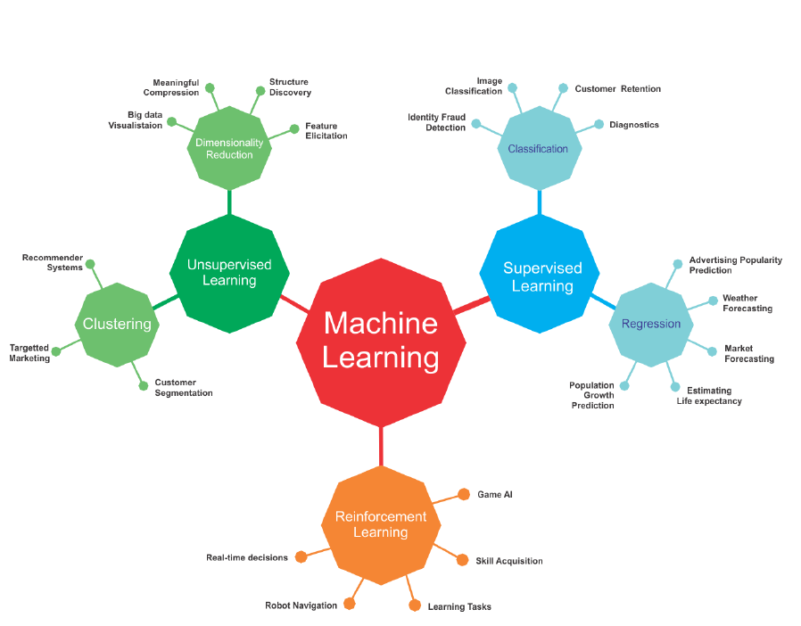
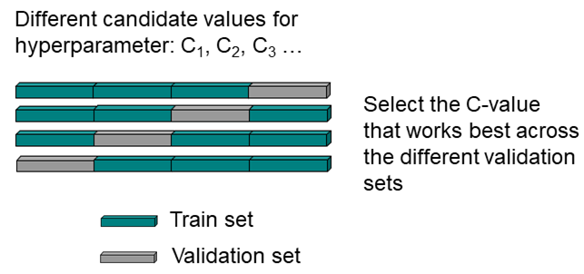
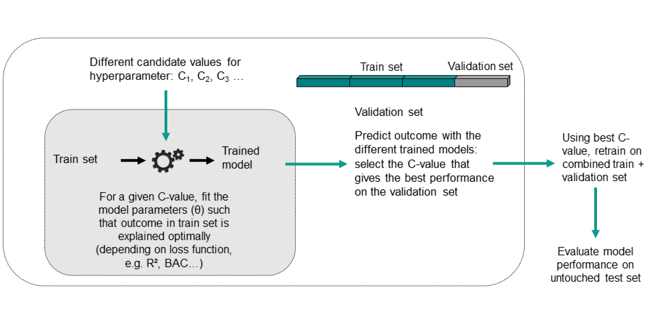

```{r setup, include=FALSE}
knitr::opts_chunk$set(echo = TRUE)
def.chunk.hook  <- knitr::knit_hooks$get("chunk")
knitr::knit_hooks$set(chunk = function(x, options) {
  x <- def.chunk.hook(x, options)
  ifelse(options$size != "normalsize", paste0("\n \\", options$size,"\n\n", x, "\n\n \\normalsize"), x)
})


library(tidyverse)
library(mlr)

```

# Structure of the tutorial
- x (today): introduction to basic R syntax and priniciples, data cleaning and wrangling
- x: Machine Learning in R (part I)
- x: Machine Learning in R (part II), working on your reports

# Today's tutorial ...
... is based on the documentation of the mlr package, the mlr3 book (https://mlr3book.mlr-org.com/index.html), and the interactive lecture "Introduction to Machine Learning" (https://introduction-to-machine-learning.netlify.app/).

# What is Machine Learning?
{ width=80% height=80% }


# Machine Learning in a nutshell
add

# Tasks
Tasks contain the data set and other relevant information about a machine learning problem, for example the name of the target variable for supervised problems.

Different types of tasks (depending on the problem): classification tasks, regression tasks, survival analysis tasks, cluster analysis tasks...


# Tasks
Example: binary classification task for breast cancer (benign vs. malignant)
```{r, include=TRUE, size="tiny"}
data(BreastCancer, package = "mlbench") # load data
classif.task <- makeClassifTask(id = "BreastCancer", data = BreastCancer %>% select(-Id), target = "Class")
classif.task
```

# Learner
 A learner is a machine learning algorithm. Most of the popular learners can generally be used for both classification and regression (e.g. SVM, Random Forests, kNN, ...).
```{r, include=TRUE, size="tiny"}
# classification random forest, set it up for predicting probabilities
classif.lrn <- makeLearner("classif.randomForest", predict.type = "prob")
classif.lrn
```

# Quiz
Which statements are true?
The target/outcome in linear regression has to be numeric
The features in linear regression have to be numeric
The classical linear model from statistics with Gaussian errors is linear regression with L2-loss

# Tuning Hyperparameters
Many machine learning algorithms have hyperparameters that need to be set. Often suitable parameter values are not obvious and it is preferable to "tune" the hyperparameters, i.e., to automatically identify values that lead to the best performance.

To tune a machine learning algorithm, you have to specify:

- the search space;
- the optimization algorithm (a.k.a. tuning method);
- an evaluation method, i.e., a resampling strategy and a performance measure.

# Tuning Hyperparameters
```{r, include=TRUE}
# create a search space for the C hyperparameter (SVM)
search_space <- makeParamSet(
  makeNumericParam("C", lower = 0.01, upper = 0.1)
)

# random search with 100 iterations
ctrl <- makeTuneControlRandom(maxit = 100)

# evaluation method could be 3-fold CV 
resample <- makeResampleDesc("CV", iters = 3L)

# use balanced accuravy (BAC) as performance measure
measure <- bac
```

# Model parameters vs. hyperparameters
Don't confuse model parameters with hyperparameters.
Model parameters are optimized during training, typically via loss minimization. They are an *output* of the training.

Examples:

- coefficients $\theta$ of a linear model f(x) = $\theta$$^T$x 
- the splits and terminal node constants of a decision tree

Hyperparameters, in contrast, are an *input* of the training, i.e., they must be specified before. Hyperparameters often control the complexity of a model.

Examples:

- the number and maximal order of interactions to be included in a linear model
- the maximum depth of a decision tree

# Model parameters vs. hyperparameters

{ width=100% height=100% }


# Resampling
Instead of using a single train/test split for tuning the hyperparameters, we can repeat the process several times to get more stable results. This resampling can have different structural forms, such as cross-validation, bootstrapping, subsampling, etc.

Example: 4-fold cross-validation

{ width=80% height=80% }

# Train - validate - test
After optimizing the hyperparameters, we typically want to evaluate our model. Evaluation on data that was part of the training process leads to overly optimistic performance estimates. For unbiased performance estimates, we need a truly "untouched" test data set only used once after a model is completely trained. 

{ width=90% height=90% }

# Nested Resampling
As with hyperparameter tuning, model evaluation can be repeated. Hence, we end up with "nested resampling" - outer resampling for model evaluation and inner resampling for hyperparameter optimization.

{ width=90% height=90% }

# Quiz
Which statements are true?
- cross-validation, bootstrap, and subsampling are resampling techniques.
- Estimating the expected generalization error is a goal of resampling.
- In resampling, the data set is split repeatedly into training and tests sets.
- Resampling strategies are completely unbiased.

Which statements are true?
- Tuning means optimizing hyperparameters.
- Doing tuning well is hard; nested resampling can help.
- Good tuning is crucial to achieve good performance for all ML algorithms.
- Tuning optimizes the inner loss.

