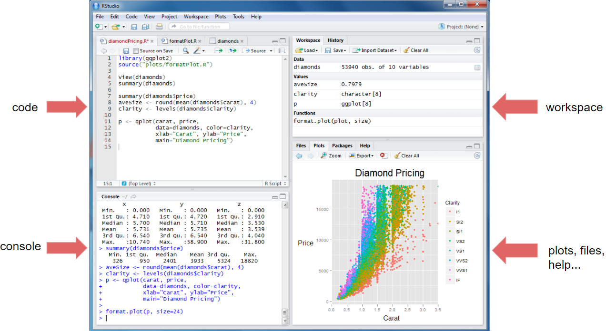
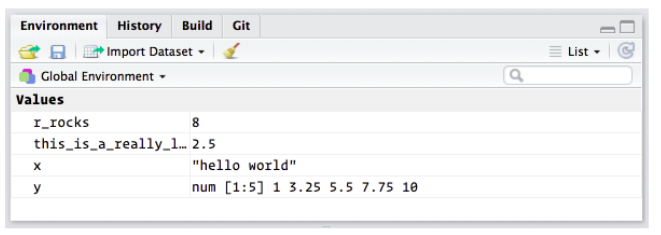
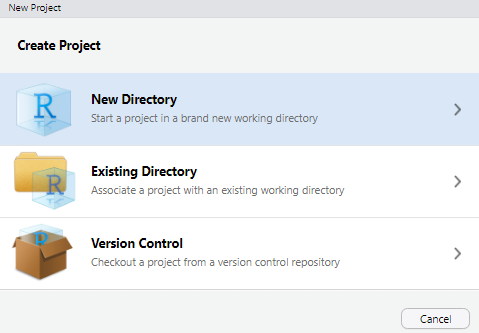
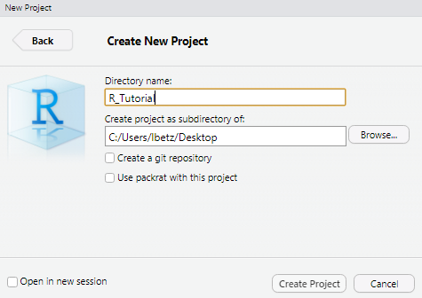
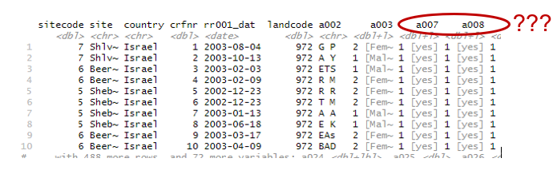
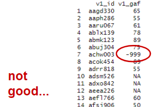
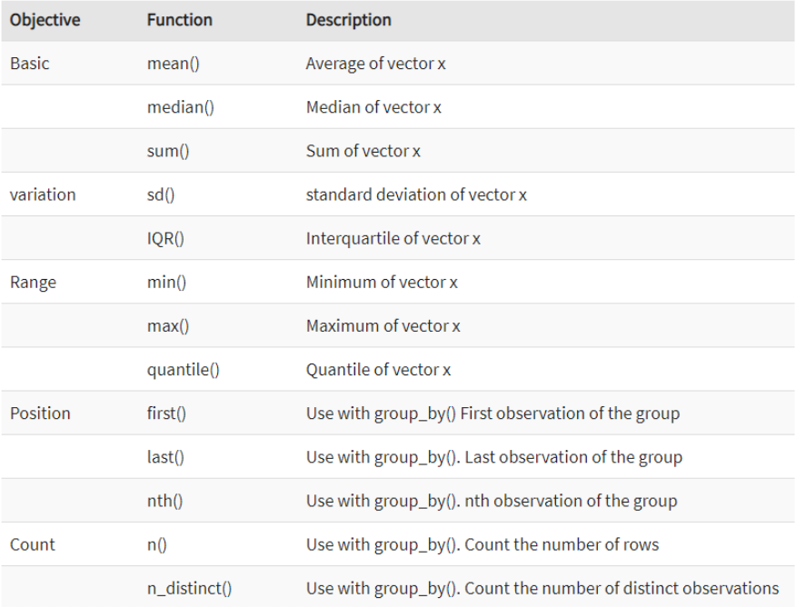

```{r setup, include=FALSE}
knitr::opts_chunk$set(echo = TRUE)
def.chunk.hook  <- knitr::knit_hooks$get("chunk")
knitr::knit_hooks$set(chunk = function(x, options) {
  x <- def.chunk.hook(x, options)
  ifelse(options$size != "normalsize", paste0("\n \\", options$size,"\n\n", x, "\n\n \\normalsize"), x)
})


library(tidyverse)

```

# Why R?

- optimized for data analysis and visualization
- open source → access to source code: everyone can check what is going on inside a function (in contrast to, e.g. SPSS) 
- many add-on packages for advanced statistical analysis
- active, inclusive community → support/feedback, sharing of code

# PART I
the basics (largely based on https://r4ds.had.co.nz/)

# Overview


# The basics
R as a "calculator":
```{r, include=TRUE}
1 / 200 * 30
(59 + 73 + 2) / 3
sin(pi / 2)
```
# The basics
You can create new objects with <-:
```{r, include=TRUE}
x <- 3 * 4
```
- All R statements where you create objects, assignment statements, have the same form
```{r eval = FALSE}
object_name <- value
```
- "object gets value"
- shortcut for “<-”: Alt + -

# The basics
object names

- … must start with a character 
- … can only contain letters, numbers, _ and ..
- good practice: “snake_case”

```{r, eval = FALSE}
i_use_snake_case
otherPeopleUseCamelCase
some.people.use.periods
And_aFew.People_RENOUNCEconvention
```

# The basics
You can inspect an object by typing its name:
```{r, include=TRUE}
x 
```

# The basics
Object names can be long:
```{r, include=TRUE}
this_is_a_really_long_name <- 2.5
```
If we made a mistake and, for instance, wanted to set the value to 3.5, wie can simply overwrite the old value.
```{r, include=TRUE}
this_is_a_really_long_name <- 3.5
```

# The basics
Make yet another assignment:
```{r, include=TRUE, size="tiny"}
r_rocks <- 2^3
```
Let’s try to inspect it:
```{r, include=TRUE, error=TRUE, size="tiny"}
r_rock
R_rocks
```
Typos matter. Case matters.

# The basics
```{r, include=TRUE, eval=FALSE}
function_name(arg1 = val1, arg2 = val2, ...)
```
# The basics
```{r}
seq(1, 10)
```

To get help, type:
```{r, eval = FALSE}
?seq
```

# The basics
{ width=90% height=90% }

# The basics
Quotation marks and parentheses must always come in a pair. RStudio does its best to help you, but it's still possible to mess up and end up with a mismatch. If this happens, R will show you the continuation character "+":

```
> x <- "hello
+
```
The `+` tells you that R is waiting for more input; it doesn't think you're done yet. Usually that means you've forgotten either a `"` or a `)`. Either add the missing pair, or press ESCAPE to abort the expression and try again.

# The basics
If you make an assignment, you don't get to see the value. You're then tempted to immediately double-check the result:

```{r}
y <- seq(1, 10, length.out = 5)
y
```

This common action can be shortened by surrounding the assignment with parentheses, which causes assignment and "print to screen" to happen.

```{r}
(y <- seq(1, 10, length.out = 5))
```

# The basics
Important:

- 99% of problems/error messages can be solved or decoded via googling 

Strategies:

- copy error messages (works best if you search the English error message, i.e., use R in English)
- search in English 
- good starting point: stackoverflow

{ width=35% height=35% }

# The basics
In the environment in the upper right pane, you can see all of the objects that you’ve created.
\
\
{ width=85% height=85% }

# Creating projects
It is common practice to keep all the files associated with a project together — input data, R scripts, analytical results, figures.
To create a project: Click File > New Project, then:  
\
\

{ width=30% height=30% }
{ width=30% height=30% }
{ width=30% height=30% }

Think carefully about which subdirectory you put the project in. 

# Creating projects
Check that the "home" directory of your project is the current working directory:
```{r}
getwd()
```
Whenever you refer to a file with a relative path it will look for it here.\
Some good practices:

- Create an R project for each data analysis project.
- Keep data files there.
- Keep scripts there; edit them, run them in bits or as a whole.
- Save your outputs (plots and cleaned data) there.
- Only ever use relative paths, not absolute paths.

# Installation of packages
Many useful functions are not built-in directly into R, but have to be imported from external extensions, so-called "packages". We first need to install them. Here, we install the tidyverse, a collection of R packages for data wrangling, analysis and visualization.
```{r, eval=FALSE}
install.packages("tidyverse")
```

# Loading data
We load files in R with the readr package. First, we load the package via `library()`. It is good practice to load all libraries you use in an analysis in the beginning of the script. Generally, packages from the tidyverse should be loaded last.
```{r, message=TRUE}
library(tidyverse)
```
Check out the print out you get when you run the code. It shows which packages are overwritten by dplyr. Some functions from base R now have to be called explicitly (e.g. stats::filter).

# Loading data
Next, we can use `read_csv()` from the tidyverse package to load the data file "data_cobre.csv". The first argument to `read_csv()` is the most important: it's the path to the file to read. If you have created a R project and have placed "data_cobre.csv" in the corresponding project folder, you can use relative rather than absolute paths to load your file:

```{r, message = TRUE, size="tiny"}
data_cobre <- read_csv("data_cobre.csv")
```
When you run `read_csv()`, it prints out a column specification with the name and type of each column. `read_csv()` uses the first line of the data for the column names, which is a common convention.

# PART II
data wrangling (largely based on https://r4ds.had.co.nz/)
\
\
{ width=60% height=60% }

# Why data wrangling?
{ width=70% height=70% }

# Why data wrangling?
Data often does not come in a tidy, ready-to-use format.

- uninformative variable names
- missing values coded as numbers (e.g. "-999") 
- outliers
- exclude people with to many missing values 
- a lot of time is spent cleaning up data

{ width=60% height=60% }
{ width=30% height=30% }

# The dataset
- open dataset from the Center for Biomedical Research Excellence (https://coins.trendscenter.org)
- contains clinical participants with various diagnoses, and healthy controls
- every row represents one participant, every column is a variable 
- we'll use neuropsych data later in our machine learning exercises
```{r, message = TRUE, size="tiny"}
data_cobre 
```

# Variable types
Letter abbreviations under the column names describe the type of each variable:

- `dbl` stands for doubles, or real numbers (0.25, 1.00, -5).
- `chr` stands for character vectors, or strings ("abc").
- `fctr` stands for factors, which R uses to represent categorical variables with fixed possible values ("female"/"male").
- `lgl` stands for logical, vectors that contain only TRUE or FALSE.

There are other common types of variables that aren’t used in this dataset:

- `int` stands for integers (1, 2, ...).
- `date` stands for dates (31.12.2020).
- `dttm` stands for date-times (a date + a time; 31.12.2020 21:00).

# Vectors
A vector is a basic data structure in R. It contains *element of the same type*. Vectors are generally created using the `c()` function.
```{r}
x <- c(1, 5, 4, 9, 0)
x
y <- c("male", "female", "female", "male")
y
```
`c()` will try and coerce elements to the *same type* if they are different.
```{r}
x <- c(1, 5.4, TRUE, "hello")
x
```

# Getting started
After loading the data, it is helpful to get an overview of what is going on. There are several options:
```{r, size="tiny"}
head(data_cobre) # show the first 6 rows of a data set
```

# Getting started
```{r, size="tiny"}
summary(data_cobre) # gives descriptive stats for every variable
```

# Getting started
```{r, size="tiny"}
data_cobre$age # shows one specific variable

table(data_cobre$gender) # shows frequency of values for one variable
```

# Getting started
```{r, size="tiny"}
data_cobre[,1] # => first column
data_cobre[1,] # => first row
data_cobre[1,1] # => first row, first column
```

# Data transformation
First, we are going to look at the five key dplyr functions that allow you to solve the vast majority of data manipulation challenges:

- Pick observations by their values (`filter()`).
- Reorder the rows (`arrange()`).
- Pick variables by their names (`select()`).
- Create new variables with functions of existing variables (`mutate()`).
- Collapse many values down to a single summary (`summarize()`).

All 'verbs' work similarly:

- The first argument is a data frame.
- The subsequent arguments describe what to do with the data frame, using the variable names (without quotes).
- The result is a new data frame.

# Filter rows with `filter()`
`filter()` allows you to subset observations based on their values. The first argument is the name of the data frame. The second and subsequent arguments are the expressions that filter the data frame. For example, we can select all participants with age 65.
```{r, size="tiny"}
filter(data_cobre, age == 65)
```
When you run that line of code, dplyr executes the filtering operation and returns a new data frame. dplyr functions *never modify their inputs*, so if you want to save the result, you’ll need to use the assignment operator, <-:
```{r, size="tiny"}
old_participants <- filter(data_cobre, age == 65)
```

# Comparisons
To use filtering effectively, you have to know how to select the observations that you want using the comparison operators. R provides the standard suite: >, >=, <, <=, != (not equal), and == (equal). When you’re starting out with R, the easiest mistake to make is to use = instead of == when testing for equality. When this happens you’ll get an informative error:
```{r, error=TRUE}
old_participants <- filter(data_cobre, age = 65)
```

# Logical operations
Multiple arguments to `filter()` are combined with “and”: every expression must be true in order for a row to be included in the output. For other types of combinations, you’ll need to use Boolean operators: 

- & is “and”
- | is “or”
- ! is “not” 
\
\
\
{ width=50% height=50% }

# Logical operations
The following code finds all participants that are either defined as "bipolar" or "schizoaffective":

```{r, size="tiny"}
filter(data_cobre, study_group == "Bipolar" | study_group == "Schizoaffective")
```

# Logical operations
A useful short-hand for this problem is x %in% y. This will select every row where x is one of the values in y. We could use it to rewrite the code above:
```{r, size="tiny"}
filter(data_cobre, study_group %in% c("Bipolar", "Schizoaffective"))
```


# Missing values
One important feature of R that can make comparison tricky are missing values, or NAs (“not availables”). NA represents an unknown value: almost any operation involving an unknown value will also be unknown.
```{r}
10 == NA
NA + 5
NA / 9
```

# Missing values
The most confusing result is this one:
```{r}
NA == NA
```

It's easiest to understand why this is true with a bit more context:
```{r}
# Let x be Pedro's age. We don't know how old he is.
x <- NA
# Let y be Julian's age. We don't know how old he is.
y <- NA
# Are Julian and Pedro the same age?
x == y
# We don't know!
```

# Missing values
If you want to determine if a value is missing, use `is.na()`:
```{r, size="tiny"}
is.na(x)
```

`filter()` only includes rows where the condition is `TRUE`; it excludes both `FALSE` and `NA` values. If you want to preserve missing values, ask for them explicitly:
```{r, size="tiny"}
df <- tibble(x = c(1, NA, 3))
filter(df, x > 1)
filter(df, is.na(x) | x > 1)
```

# Excercises
Before getting started with the exercises, please make sure you have run the following code:
```{r, eval=FALSE}
install.packages("tidyverse") # install package we need
library(tidyverse) # load the package 
data_cobre <- read_csv("data_cobre.csv") # load data
```

# Excercises
- Find all participants who are 19 and younger. How many are there?
- Find all healthy control participants who are 19 and younger. How many are there?
- Find all women who are healthy controls and either have been diagnosed with bipolar disorder or schizophrenia. How many are there?
- How many patients have a missing value in the variable `age_onset_psychiatric_illness`?
- BONUS: Why does `NA ^ 0` not return `NA`? Why is `NA | TRUE` not `NA`?

# Solutions
Find all participants who are 19 and younger. How many are there?
```{r, size="tiny"}
filter(data_cobre, age <= 19)
```

# Solutions
Find all healthy control participants who are 19 and younger. How many are there?
```{r, size="tiny"}
filter(data_cobre, study_group == "Control" & age <= 19)
```

# Solutions
Find all women who have been diagnosed with either bipolar disorder or schizophrenia. How many are there?
```{r, size="tiny"}
filter(data_cobre, gender == "female" & study_group %in% c("Bipolar", "Schizophrenia"))
```

# Solutions
How many patients have a missing value in the variable `age_onset_psychiatric_illness`?
```{r, size="tiny"}
filter(data_cobre, study_group != "Control" & is.na(age_onset_psychiatric_illness))
```

# Arrange rows with `arrange()`
`arrange()` works similarly to `filter()` except that instead of selecting rows, it changes their order. It takes a data frame and a set of column names (or more complicated expressions) to order by. If you provide more than one column name, each additional column will be used to break ties in the values of preceding columns:
```{r, size="tiny"}
arrange(data_cobre, age)
```

# Arrange rows with `arrange()`
Use `desc()` to re-order by a column in descending order:
```{r, size="tiny"}
arrange(data_cobre, desc(age))
```
Missing values are always sorted at the end.

# Select columns with `select()`
It’s not uncommon to get datasets with hundreds or even thousands of variables. `select()` allows you to select a useful subset using operations based on the names of the variables.

`select()` is not super useful with our dataset because we only have `r ncol(data_cobre)` variables, but you can still get the general idea:
```{r, size="tiny"}
select(data_cobre,  id,  age, gender)
```

# Select columns with `select()`
There are a number of helper functions you can use within `select()`:

- starts_with("abc"): matches names that begin with “abc”.
- ends_with("xyz"): matches names that end with “xyz”.
- contains("ijk"): matches names that contain “ijk”.
- matches("(.)\\1"): selects variables that match a regular expression. 
- num_range("x", 1:3): matches x1, x2 and x3.

```{r, size="tiny"}
select(data_cobre, contains("age"))
```

# Select columns with `select()`
Another option is to use `select()` in conjunction with the `everything()` helper. This is useful if you have a handful of variables you’d like to move to the start of the data frame.

```{r, size="tiny"}
select(data_cobre, study_group, everything()) 
```

# Rename variables
```{r, size="tiny"}
rename(data_cobre, participant_id = id) # logic: new_name = old_name
```

# Exercises
- Rename all variables such that they contain upper case letters only.
- Select all variables that contain the word "study".
- Conceptually, what's the difference between `filter()` and `select()`?

# Solutions
Rename all variables such that they contain upper case letters only.
```{r, size="tiny"}
rename_with(data_cobre, toupper)
```

# Solutions
Select all variables that contain the word "study".
```{r, size="tiny"}
select(data_cobre, contains("study"))
```

# Add new variables with `mutate()`
`mutate()` adds new columns that are functions of existing columns. `mutate()` always adds new columns at the end of your dataset.
```{r, size="tiny"}
mutate(data_cobre, age_months = age*12) # age in months
```
If you only want to keep the new variables, use `transmute()`:
```{r, size="tiny"}
transmute(data_cobre, age_months = age*12) # age in months
```

# Useful creation functions
There are many functions for creating new variables that you can use with `mutate()`. The function must have a key property: it must take a vector of values as input, return a vector with the same number of values as output. Some examples:

- Arithmetic operators: +, -, *, /, ^.
- Modular arithmetic: %/% (integer division) and %% (remainder)
- Logs: log(), log2(), log10()
- Logical comparisons: <, <=, >, >=, !=, and ==

# Exercises
- Create a new variable `patient` that indicates if a participant has been diagnosed with any disorder or not.
- Z-transform the variable `age`, and store the result in a new variable `age_z_score`.

# Solutions
Create a new variable "patient" that indicates if a participant has been diagnosed with any disorder or not.
````{r, size="tiny"}
mutate(data_cobre, patient = if_else(study_group == "Control", true = TRUE, false = FALSE)) 
```

# Solutions
Z-transform the variable "age", and store the result in a new variable "age_z_score".
````{r, size="tiny"}
mutate(data_cobre, age_z_score = (age-mean(age))/sd(age))
```

# Part III
Summarize variables with `summarize()`

# Grouped summaries with `summarize()`

The last key data operation we'll look at is `summarize()`. It collapses a data frame to a single row:
```{r, size="tiny"}
summarize(data_cobre, age_mean = mean(age)) 
```
`summarize()` is not terribly useful unless we pair it with `group_by()`. When you then use the dplyr verbs on a grouped data frame they’ll be automatically applied “by group”.

````{r, size="tiny"}
by_group <- group_by(data_cobre, study_group) # save grouped data frame here
summarize(by_group, age = mean(age), .groups = "keep") # mean age per group
```

# Grouped summaries with `summarize()`
{ width=90% height=90% }

# Combining multiple operations with the pipe (`%>%`)
````{r, size="tiny"}
by_group <- group_by(data_cobre, study_group) # save grouped data frame here
mean_age_groups <- summarize(by_group, age = mean(age), .groups = "drop") # mean age per group
filtered_age <- filter(mean_age_groups, age > 39)
```

An alternative, faster and less frustrating way to tackle this proplem is the pipe operator (`%>%`), which focuses on the transformations, not what’s being transformed, which makes the code easier to read. You can read it as a series of imperative statements: group, then summarize, then filter.

````{r, size="tiny"}
data_cobre %>% 
  group_by(study_group) %>% # save grouped data frame here
  summarize(age = mean(age), .groups = "drop") %>% # mean age per group
  filter(age > 39)
```

# Combining multiple operations with the pipe (`%>%`)
{ width=80% height=80% }


# Useful summary functions
{ width=80% height=80% }

# Grouping by multiple variables
When you group by multiple variables, each summary peels off one level of the grouping:

````{r, size="tiny"}
data_cobre %>% 
  group_by(study_group, first_degree_relative_psychosis) %>% # save grouped data frame here
  summarize(age_mean = mean(age), age_sd = sd(age), .groups = "drop") # mean/SD age per group
```

# Missing values (again)
Aggregation functions obey the usual rule of missing values: if there’s any missing value in the input, the output will be a missing value.
````{r, size="tiny"}
data_cobre %>% 
  summarize(age_onset_mean = mean(age_onset_psychiatric_illness))
```
All aggregation functions have an `na.rm` argument which removes the missing values prior to computation:
````{r, size="tiny"}
data_cobre %>% 
  summarize(age_onset_mean = mean(age_onset_psychiatric_illness, na.rm = TRUE))
```
This mean onset age, however, is far too high. Something else is wrong here... 

# Problematic coding of missing values
Let's look at the variable more closely:
````{r, size="tiny"}
table(data_cobre$age_onset_psychiatric_illness)
```
Looks like missing values are coded as '9999'. Let's change that:
````{r, size="tiny"}
data_cobre %>%
  mutate(
    age_onset_psychiatric_illness = if_else( # recode 9999 to NA
      age_onset_psychiatric_illness == "9999",
      true = NA_real_, # convert character to numeric vector
      false = as.numeric(age_onset_psychiatric_illness) # convert character to numeric vector
    )
  ) %>%
  summarize(mean = mean(age_onset_psychiatric_illness, na.rm = TRUE))
```

# Exercises (use `%>%`)
- Compute the mean (sd) age for patients who have a first degree relative with a psychotic disorder and those who do not.
- Recode the values in the variables `age_onset_psychiatric_illness` and `age_first_hospitalization` such that it can be analyzed properly. Overwrite the existing variables in `data_cobre`.
- Create a new variable that gives the time since the onset of psychiatric illness in years. Then compute the mean time since onset of psychiatric illness for men and women.
- Compute the earliest and latest age of onset of psychiatric illness.
- Compute the median of age of onset of psychiatric illness by diagnosis.

# Solutions
Compute the mean (sd) age for patients who have a first degree relative with a psychotic disorder and those who do not.
````{r, size="tiny"}
data_cobre %>%
  filter(study_group != "Control" &
           !is.na(first_degree_relative_psychosis)) %>%
  group_by(first_degree_relative_psychosis) %>%
  summarize(age_mean = mean(age),
            age_sd = sd(age),
            .groups = "keep")
```

# Solutions
Recode the values in the variables `age_onset_psychiatric_illness` and `age_first_hospitalization` such that it can be analyzed properly. Overwrite the existing variables in `data_cobre`.
````{r, size="tiny"}
data_cobre <- data_cobre %>%
  mutate(
    age_onset_psychiatric_illness = if_else(
      # recode 9999 to NA
      age_onset_psychiatric_illness == "9999",
      true = NA_real_,
      false = as.numeric(age_onset_psychiatric_illness)
    ),
    age_first_hospitalization = if_else(
      # recode 9999 to NA
      age_first_hospitalization == "9999",
      true = NA_real_,
      false = as.numeric(age_first_hospitalization)
    )
  ) 
```

# Solutions
Create a new variable that gives the time since the onset of psychiatric illness in years. Then compute the mean time since onset of psychiatric illness for men and women.
````{r, size="tiny"}
data_cobre %>%
  mutate(illness_duration = age - age_onset_psychiatric_illness) %>%
  group_by(gender) %>%
  summarize(mean = mean(illness_duration, na.rm = TRUE),
            .groups = "keep")
```

# Solutions
Compute the earliest and latest age of onset of psychiatric illness.
````{r, size="tiny"}
data_cobre %>%
  summarize(age_onset_min = min(age_onset_psychiatric_illness, na.rm = TRUE),
            age_onset_max = max(age_onset_psychiatric_illness, na.rm = TRUE))
```

# Solutions
Compute the median of age of onset of psychiatric illness by diagnosis.
````{r, size="tiny"}
data_cobre %>%
  filter(study_group != "Control") %>%
  group_by(study_group) %>%
  summarize(age_onset_median = median(age_onset_psychiatric_illness, na.rm = TRUE),
             .groups = "keep")
```